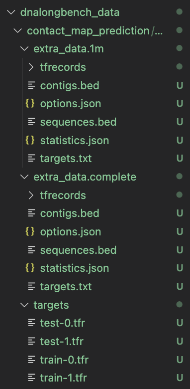

# Contact Map Prediction - DNALongBench

Minimal training and evaluation script for the DNALongBench Contact Map Prediction (CMP) task. We can plug in our own transformer implementation thru my_models.py

## Installation

### 1. Create Conda Environment

```bash
conda create -n dnalongbench python=3.9 -y
conda activate dnalongbench
```

### 2. Install Dependencies

```bash
pip install -r requirements.txt
```

**requirements.txt:**
```
torch>=2.0.0
dnalongbench
```

### 3. Download CMP Dataset

```bash
# Create data directory
mkdir -p ~/dnalongbench_data
cd ~/dnalongbench_data

# Download dataset (25GB zipped)
curl -L -J -o cmp.zip \
  "https://dataverse.harvard.edu/api/access/dataset/:persistentId/?persistentId=doi:10.7910/DVN/AZM25S&format=original"

# Extract (handling zipbomb detection)
mkdir -p contact_map_prediction
UNZIP_DISABLE_ZIPBOMB_DETECTION=TRUE unzip -o cmp.zip -d contact_map_prediction
```

**Note**: Since i didn’t have enough disk space i continued with partial .tfr files downloaded. Currently it looks like: 



### 4. Verify Installation

```bash
python sanity_cmp.py
```

Expected output:
```
✓ Data loads successfully
  x: (1, 1048576, 4) torch.int8
  y: (1, 99681) torch.float16
```

---

## Quick Start

```bash
# 1. Create your model (see my_models.py for template)

# 2. Train your model
python train_eval_cmp.py --model "my_models:SparseTransformer" --steps 1000

# 3. Results will show at the end:
# Valid | PCC: 0.5234 | SCC: 0.6127
# Test  | PCC: 0.5189 | SCC: 0.6043
```
That's all to run the task minimally. Information below is extra.


---

## Model Requirements

Your model must:
- **Input**: `(batch_size, 1048576, 4)` dtype `int8` - one-hot DNA sequence
- **Output**: `(batch_size, 99681)` dtype `float32` - contact map predictions
- Be a `torch.nn.Module` with trainable parameters

The 99,681 output dimension is the upper triangle of a 448×448 contact matrix (with diagonal offset=2).

---

## Training Options

### Basic Training
```bash
python train_eval_cmp.py --model "my_models:MyModel" --steps 1000
```

### Custom Hyperparameters
```bash
python train_eval_cmp.py \
  --model "my_models:MyModel" \
  --steps 5000 \
  --lr 5e-4 \
  --batch_size 2 \
  --log_every 100
```

### Different Cell Type
```bash
python train_eval_cmp.py \
  --model "my_models:MyModel" \
  --subset GM12878 \
  --steps 2000
```

### Custom Checkpoint Name
```bash
python train_eval_cmp.py \
  --model "my_models:MyModel" \
  --steps 1000 \
  --save my_checkpoint.pt
```

---

## Evaluation Only

```bash
# Load trained model and evaluate
python train_eval_cmp.py \
  --model "my_models:MyModel" \
  --checkpoint model.pt \
  --eval_only
```

---

## What Happens During Training

```
Step     0 | Loss: 0.0234 | PCC: 0.0823 | SCC: 0.1245
Step    50 | Loss: 0.0198 | PCC: 0.1456 | SCC: 0.2103
Step   100 | Loss: 0.0167 | PCC: 0.2134 | SCC: 0.2891
...
Step  1000 | Loss: 0.0089 | PCC: 0.5234 | SCC: 0.6127

✓ Saved model to model.pt

=== Final Evaluation ===
Valid | PCC: 0.5234 | SCC: 0.6127
Test  | PCC: 0.5189 | SCC: 0.6043
```

---

## Output Metrics

- **PCC** (Pearson Correlation Coefficient): Measures linear correlation between predictions and true values. Range: 0-1, higher is better.
- **SCC** (Stratified Contact Correlation): Distance-stratified correlation inspired by HiCRep. Accounts for the fact that nearby genomic regions naturally have higher contact frequency. Range: 0-1, higher is better.

---

## Common Issues

### GLIBCXX Error (HPC environments)
```bash
export LD_PRELOAD="$CONDA_PREFIX/lib/libstdc++.so.6"
```

Add this to your `setup.sh` or `.bashrc`.

### Out of Memory
- Use `--batch_size 1` (default)
- Reduce model size
- Use gradient checkpointing in your model
- Try a smaller subset for testing

### Slow Training
- Use `--steps 100` for quick testing
- Increase `--batch_size` if you have memory
- Verify model is on GPU (default if CUDA available)
- Check data loading isn't the bottleneck

### Partial Data (Incomplete Download)
The script handles partial `.tfr` files gracefully. You can:
- Use `--eval_batches 10` to limit evaluation to fewer batches
- Train with whatever data you have
- Download only specific shards you need

---

## File Structure

```
your_project/
├── train_eval_cmp.py       # Main training/evaluation script
├── my_models.py            # Your model definitions
├── sanity_cmp.py          # Data verification script
├── requirements.txt        # Dependencies
├── setup.sh               # HPC environment setup (optional)
├── README.md              # This file
└── model.pt               # Saved checkpoint (after training)

# Not in git:
└── dnalongbench_data/     # Downloaded dataset (~25GB)
    └── contact_map_prediction/
        └── contact_map_prediction/
            └── targets/
                ├── train-*.tfr
                ├── valid-*.tfr
                └── test-*.tfr
```

---

## Example Model Template

See `my_models.py` for a complete example. Your model should follow this structure:

```python
import torch
import torch.nn as nn

class SparseTransformer(nn.Module):
    def __init__(self):
        super().__init__()
        # Your architecture here
        
    def forward(self, x: torch.Tensor) -> torch.Tensor:
        """
        Args:
            x: (B, 1048576, 4) - one-hot DNA sequence
        Returns:
            pred: (B, 99681) - contact map upper triangle
        """
        # Your forward pass here
        ...
        return pred  # Must be shape (B, 99681)
```
